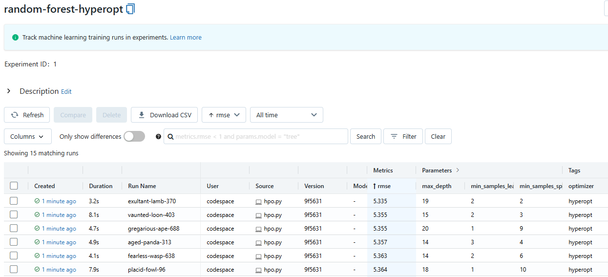

# Homework #2: MLflow - Experiment Tracking and Model Management

## Goal of this homework:
To get familiar with MLflow, the tool for experiment tracking and model management.

---

## Q1. Install MLflow

**Task:**
Install the MLflow Python package. After installing the package, run the command `mlflow --version` and check the output. What's the version that you have?

**Answer:**
My MLflow version is: `1.30.0`

**Installation and Version Check Process:**
I installed MLflow using conda:
```bash
conda install -c conda-forge mlflow
```
After installation, I encountered a `ModuleNotFoundError: No module named 'databricks_cli'`.
I updated conda and related packages:
```bash
conda update -n base -c defaults conda
```
After this, the `mlflow --version` command executed successfully:
```bash
(base) @data-tomic ➜ /workspaces/mlops-zoomcamp (main) $ mlflow --version
mlflow, version 1.30.0
```

---

## Q2. Download and preprocess the data

**Task:**
Download the data for January, February, and March 2023. Use the script `preprocess_data.py`.
`python preprocess_data.py --raw_data_path <TAXI_DATA_FOLDER> --dest_path ./output`
How many files were saved to `OUTPUT_FOLDER`?
*   1
*   3
*   4
*   7

**Answer:**
`4`

**Actions:**
1.  **Data Download:**
    *   Created a directory for the raw data:
        ```bash
        (base) @data-tomic ➜ /workspaces/mlops-zoomcamp/02-experiment-tracking (main) $ mkdir raw
        (base) @data-tomic ➜ /workspaces/mlops-zoomcamp/02-experiment-tracking (main) $ cd raw
        ```
    *   Downloaded the Parquet files for Green taxi trips for January, February, and March 2023 into the `raw` directory:
        ```bash
        # In /workspaces/mlops-zoomcamp/02-experiment-tracking/raw
        wget https://d37ci6vzurychx.cloudfront.net/trip-data/green_tripdata_2023-01.parquet
        wget https://d37ci6vzurychx.cloudfront.net/trip-data/green_tripdata_2023-02.parquet
        wget https://d37ci6vzurychx.cloudfront.net/trip-data/green_tripdata_2023-03.parquet
        ```
    *   Returned to the parent directory:
        ```bash
        cd ..
        ```

2.  **Preprocessing:**
    *   Created an output directory:
        ```bash
        (base) @data-tomic ➜ /workspaces/mlops-zoomcamp/02-experiment-tracking (main) $ mkdir output
        ```
    *   Executed the preprocessing script from the `/workspaces/mlops-zoomcamp/02-experiment-tracking` directory, pointing to the `raw` data and `output` directories:
        ```bash
        (base) @data-tomic ➜ /workspaces/mlops-zoomcamp/02-experiment-tracking (main) $ python preprocess_data.py --raw_data_path raw --dest_path ./output
        ```
        *(This command executed successfully after all three parquet files were present in the `raw` directory.)*

3.  **Verification:**
    *   Checked the contents of the `./output` folder:
        ```bash
        (base) @data-tomic ➜ /workspaces/mlops-zoomcamp/02-experiment-tracking (main) $ ls -la output/
        total 7024
        drwxrwxrwx+ 2 codespace codespace    4096 May 25 12:04 .
        drwxrwxrwx+ 4 codespace codespace    4096 May 25 11:56 ..
        -rw-rw-rw-  1 codespace codespace  131004 May 25 12:04 dv.pkl
        -rw-rw-rw-  1 codespace codespace 2458696 May 25 12:04 test.pkl
        -rw-rw-rw-  1 codespace codespace 2374516 May 25 12:04 train.pkl
        -rw-rw-rw-  1 codespace codespace 2215822 May 25 12:04 val.pkl
        ```
    *   The following 4 files were present: `dv.pkl`, `test.pkl`, `train.pkl`, `val.pkl`.

---

## Q3. Train a model with autolog

**Task:**
Modify the `train.py` script to enable MLflow autologging. What is the value of the `min_samples_split` parameter?
*   2
*   4
*   8
*   10

**Answer:**
`2`

**Changes in `train.py`:**
```python
import os
import pickle
import click
import mlflow
import mlflow.sklearn

from sklearn.ensemble import RandomForestRegressor
from sklearn.metrics import mean_squared_error


def load_pickle(filename: str):
    with open(filename, "rb") as f_in:
        return pickle.load(f_in)


@click.command()
@click.option(
    "--data_path",
    default="./output",
    help="Location where the processed NYC taxi trip data was saved"
)
def run_train(data_path: str):

    mlflow.sklearn.autolog()

    with mlflow.start_run():
        mlflow.set_tag("developer", "Ded Moroz")
        mlflow.set_tag("model_type", "RandomForestRegressor")

        X_train, y_train = load_pickle(os.path.join(data_path, "train.pkl"))
        X_val, y_val = load_pickle(os.path.join(data_path, "val.pkl"))

        rf = RandomForestRegressor(max_depth=10, random_state=0)
        rf.fit(X_train, y_train)
        y_pred = rf.predict(X_val)

        rmse = mean_squared_error(y_val, y_pred, squared=False)
        print(f"RMSE: {rmse}")

if __name__ == '__main__':
    run_train()
```
---

## Q4. Launch the tracking server locally

**Task:**
Launch a tracking server on your local machine, select a SQLite db for the backend store and a folder called `artifacts` for the artifacts store.
In addition to `backend-store-uri`, what else do you need to pass to properly configure the server?
*   `default-artifact-root`
*   `serve-artifacts`
*   `artifacts-only`
*   `artifacts-destination`

**Answer:**
`default-artifact-root`

**Actions:**
1.  Stopped any previous `mlflow ui` instances.
2.  Created a directory for artifacts. I named it `artifacts_q4` to distinguish it, but the homework refers to `artifacts`.
    ```bash
    # In /workspaces/mlops-zoomcamp/02-experiment-tracking
    mkdir artifacts_q4 
    ```
3.  Launched the MLflow tracking server with SQLite as backend and the created folder as the artifact root. I used port 5001 for this example:
    ```bash
    mlflow server \
        --backend-store-uri sqlite:///mlflow.db \
        --default-artifact-root ./artifacts_q4 \
        --port 5001
    ```
    If using the default port 5000 and an artifact folder named `artifacts`:
    ```bash
    # mlflow server \
    #     --backend-store-uri sqlite:///mlflow.db \
    #     --default-artifact-root ./artifacts 
    ```
4.  The server started successfully, listening on `http://127.0.0.1:5001`.
5.  This server will be kept running for Q5 and Q6.
6.  The parameter `default-artifact-root` is used to specify the location for storing artifacts (like models, plots, etc.).


---

## Q5. Tune model hyperparameters

**Task:**
Modify the `hpo.py` script to log validation RMSE and parameters to MLflow. Do not use autologging. What's the best (lowest) validation RMSE that you got?
*   4.817
*   5.335
*   5.818
*   6.336

**Answer:**
`5.335`

**Changes in `hpo.py`:**
```python
import os
import pickle
import click
import mlflow
import numpy as np
from hyperopt import STATUS_OK, Trials, fmin, hp, tpe
from hyperopt.pyll import scope
from sklearn.ensemble import RandomForestRegressor
from sklearn.metrics import mean_squared_error

# Ensured MLFLOW_TRACKING_URI points to the server from Q4 (e.g., http://127.0.0.1:5000)
MLFLOW_TRACKING_URI = "http://127.0.0.1:5000" # Or your actual server URI
EXPERIMENT_NAME = "random-forest-hyperopt"

mlflow.set_tracking_uri(MLFLOW_TRACKING_URI)
mlflow.set_experiment(EXPERIMENT_NAME)


def load_pickle(filename: str):
    with open(filename, "rb") as f_in:
        return pickle.load(f_in)


@click.command()
@click.option(
    "--data_path",
    default="./output",
    help="Location where the processed NYC taxi trip data was saved"
)
@click.option(
    "--num_trials",
    default=15,
    type=int,
    help="The number of parameter evaluations for the optimizer to explore"
)
def run_optimization(data_path: str, num_trials: int):

    X_train, y_train = load_pickle(os.path.join(data_path, "train.pkl"))
    X_val, y_val = load_pickle(os.path.join(data_path, "val.pkl"))

    def objective(params):
        with mlflow.start_run():
            mlflow.set_tag("optimizer", "hyperopt")
            # Parameters are already int due to scope.int in search_space
            mlflow.log_params(params) 

            rf = RandomForestRegressor(**params)
            rf.fit(X_train, y_train)
            y_pred = rf.predict(X_val)
            rmse = mean_squared_error(y_val, y_pred, squared=False)

            mlflow.log_metric("rmse", rmse)

        return {'loss': rmse, 'status': STATUS_OK}

    search_space = {
        'max_depth': scope.int(hp.quniform('max_depth', 1, 20, 1)),
        'n_estimators': scope.int(hp.quniform('n_estimators', 10, 50, 1)),
        'min_samples_split': scope.int(hp.quniform('min_samples_split', 2, 10, 1)),
        'min_samples_leaf': scope.int(hp.quniform('min_samples_leaf', 1, 4, 1)),
        'random_state': 42
    }

    rstate = np.random.default_rng(42)
    fmin(
        fn=objective,
        space=search_space,
        algo=tpe.suggest,
        max_evals=num_trials,
        trials=Trials(),
        rstate=rstate
    )


if __name__ == '__main__':
    run_optimization()
```
MLflow UI Screenshot for Q5:



---

## Q6. Promote the best model to the model registry

**Task:**
Update the `register_model.py` script to select the model with the lowest RMSE on the test set from the top 5 HPO runs and register it to the model registry. What is the test RMSE of the best model?
*   5.060
*   5.567
*   6.061
*   6.568

**Answer:**
`5.567`

**Changes in `register_model.py` (summary of key logic):**
The script was updated to:
1.  Connect to the MLflow tracking server (e.g., `http://127.0.0.1:5000`).
2.  Fetch the top 5 runs from the `random-forest-hyperopt` experiment based on validation RMSE.
3.  For each of these HPO runs:
    a.  Start a new MLflow run within the `random-forest-best-models` experiment.
    b.  Log the HPO parameters.
    c.  Train a `RandomForestRegressor` model using these parameters on the training data (`train.pkl`).
    d.  Evaluate the model on the test data (`test.pkl`) to get `test_rmse`.
    e.  Log the `test_rmse` and the trained model (`mlflow.sklearn.log_model(rf, "model")`) to the new run.
    f.  Keep track of the `run_id` and `test_rmse` for this new run.
4.  After evaluating all top 5 HPO configurations, identify the run from `random-forest-best-models` that achieved the lowest `test_rmse`.
5.  Register the model from this best run to the MLflow Model Registry using `mlflow.register_model()` with `model_uri="runs:/<BEST_RUN_ID>/model"` and a chosen model name (e.g., "GreenTaxiBestRF").

**Actions:**
1.  Ensured the MLflow server (from Q4, running on `http://127.0.0.1:5000`) was active.
2.  Modified and executed the `register_model.py` script.
3.  The script processed 5 models. The best `test_rmse` obtained was `5.567408012462019`.
    Relevant console output:
    ```
    Best model for registration is from run_id: 4430b1fca2c24518953a5674f0b10b1b with Test RMSE: 5.567408012462019
    ...
    Model 'GreenTaxiBestRF' version 1 registered successfully.
    ```
4.  The model corresponding to this lowest test RMSE was successfully registered in the MLflow Model Registry under the name "GreenTaxiBestRF".
5.  The closest answer option to `5.567408...` is `5.567`.


---

## Submit the results
Results will be submitted via the form: [https://courses.datatalks.club/mlops-zoomcamp-2024/homework/hw2](https://courses.datatalks.club/mlops-zoomcamp-2024/homework/hw2)